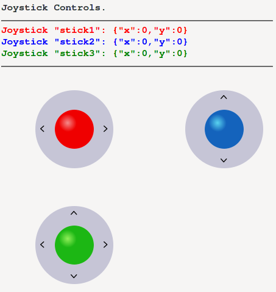

# HTML-Joysticks

Simple joystick-style controls with HTML/JavaScript, supporting desktop/touchscreen as well as mobile.

Provides Joysticks in multiple colors. You can modify the SVG-file to easily change colors or add new ones if needed.

